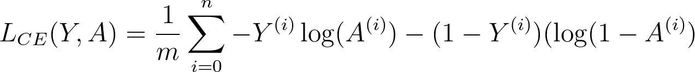
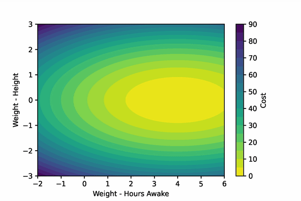
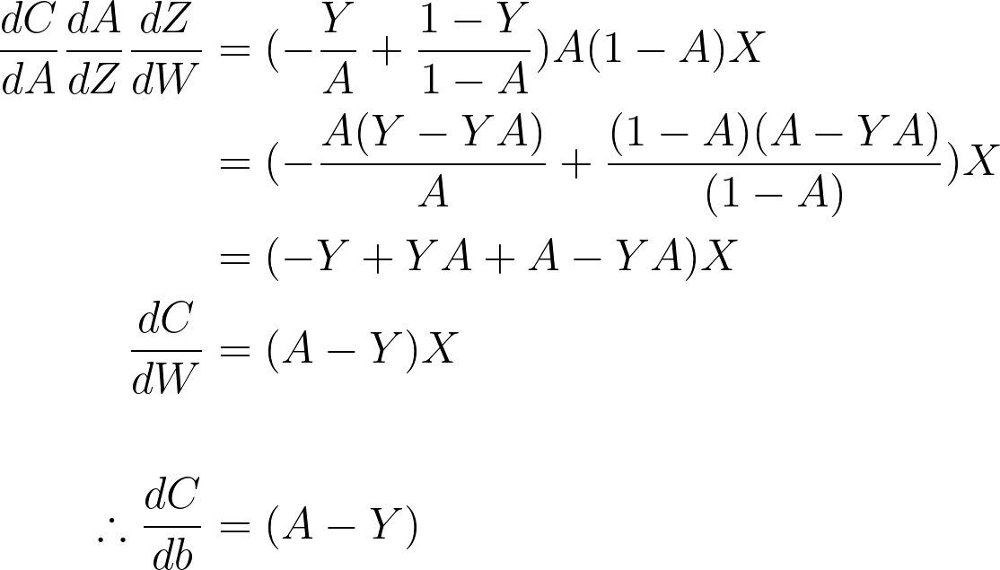

# Breaking it Down: Logistic Regression
Exploring the fundamentals of logistic regression from scratch with NumPy, TensorFlow, and the UCI Heart Disease Dataset.

**Outline**
1. What is Logistic Regression?
2. Breaking Down Logistic Regression
    1. Linear Transformation
    2. Sigmoid Activation
    3. Cross-Entropy Cost Function
    4. Gradient Descent
    5. Fitting the Model
3. Learning by Example with the UCI Heart Disease Dataset
4. Training and Testing the Classifier
5. Implementing Logistic Regression with TensorFlow

### **1. What is Logistic Regression?**
[Logistic regression][wiki] is a supervised machine learning algorithm used to create probabilistic classifications ([1][stanford], [2][ng]). These classifications are often binary. For example, an input picture either *does* or *does not* contain an elephant.

[wiki]: https://en.wikipedia.org/wiki/Logistic_regression
[stanford]: https://web.stanford.edu/~jurafsky/slp3/5.pdf
[ng]: https://see.stanford.edu/materials/aimlcs229/cs229-notes1.pdf


The 'supervised' nature of logit models indicates that they require labeled data to be trained. This training data is used to *tune* the classifier to accurately predict classification labels via gradient descent ([check out my gradient descent article for more details][grad]).

[grad]: https://pub.towardsai.net/breaking-it-down-gradient-descent-b94c124f1dfd

In this article, we will explore the fundamentals of logistic regression and build a model from scratch with NumPy. To learn by example, we'll train this model to predict whether adults have heart disease based on input health data. We'll conclude by creating a logit model with TensorFlow and comparing its results to our own.

### **2. Breaking Down Logistic Regression**
Logistic regression models create probability labels (***Y***) for input data (***X***) by applying the logistic function:


Let's break this equation down into it's two parts:

- First, the model applies a linear transformation to the input data (***W &bull; B + b***).

> The **Weights** (***W***) vector of the classifier indicate _how important_ each of the input variables are to the classification. The dot product of the ***Weights*** and input data ***X*** is first computed to create a linear decision boundary. Then, the **bias** (***b***) scalar is used to shift the placement of the linear decision boundary.

- Second, the model applies a non-linear sigmoid transformation (&sigma;) to the result from the previous layer. 

> The output from the second step is our probability labels for the input data ***X***. The probability labels ***Y*** will be between ***0-1***. Probabilities ***≥0.5*** will have a "positive" label, and Probabilities ***<0.5*** will have a negative label.

Now we must naturally ask, how does the model know the appropriate **Weights** and **bias** values to generate accurate probability labels? The model parameters are learned in an iterative two-step approach:

- First, the model generates probability labels for a set of input data and compares those labels to the ground-truth labels. The average *difference* between the labels and ground-truths are then computed with the **cross-entropy cost function**.

- Second, this cost function is used to *optimize* the parameters of the model. This optimization occurs via the process of gradient descent. In our model, we'll use *mini-batch gradient descent*. Descending the gradient of the parameters *tunes* the values so that they *minimize* the distance between the output probability labels and the ground-truth labels.

To make sure we truly understand each of these steps, let's build a logistic regression model from scratch with NumPy. The model's outline will look like this:

https://gist.github.com/JacobBumgarner/1f7d390de6e55a48fd131a2151d7fe1e

Now, let's walk through each of these main functions step-by-step.

#### **2.1 Linear Transformation**
Before we can create the linear transformation function, we need to first initialize our model with the **Weights** and **bias** parameters. Traditionally, these parameters will be initialized to **0**.

In our model, the **Weights** parameter will be an `(n, 1)` shaped array, where `n` is equal to the number of features in the input data. The **bias** parameter is a scalar.

https://gist.github.com/JacobBumgarner/1360d3231d086a5e38173fbc5579e13c

Now, we can create a function that computes the linear portion of the logit function, as seen below.


https://gist.github.com/JacobBumgarner/030c1b10611f46a0d7fc5d2b0fa68a70

#### **2.2 Sigmoid Activation**
Next, we need to create the sigmoid function that will convert the output from the liner layer into probabilistic label.

The sigmoid activation function takes a real input number and returns an output scaled between 0 and 1. Monotonically increasing input variables return values that approach 1. The sigmoid function is seen below alongside the plotted function.


Importantly, this sigmoid function outputs a probability (***p***) that allows us to create classifications for the input features. We define our decision bounadry to be ***0.5***, so that when ***p ≥ 0.5***, we classify ***y=1***, and when ***p < 0.5***, we classify ***y=0***.

Let's populate the sigmoid function for our model.

https://gist.github.com/JacobBumgarner/bc6ab99b173b45a25b86a3995a414238

#### **2.3 Cross-Entropy Cost Function**
In order to train our model's parameters, we must define some function that will indicate whether the parameters did a 'good' or 'bad' job at creating a probability label for some input data. This 'goodness' factor, or the difference between the probability label and the ground-truth label is called *loss* for individual samples. The *losses* across the training data are then averaged to create a *cost*.

We operationally say that the cost should be *high* if the parameters did a bad job at predicting the label, and *low* if they did a good job.

The function that has been adopted for logistic regression is the **Cross-Entropy Cost Function**. In the function below, ***Y*** is the ground-truth label, and ***A*** is our probabilistic label.



Notice that the function changes based on whether ***y*** is ***1*** or ***0***.

- When ***y = 1***, the function computes the ***log*** of the label. If the prediction is correct, the *loss* will be ***0*** (i.e., ***log(1) = 0***). If it's incorrect, the loss will get larger and larger as the prediction approaches ***0***.
- When ***y = 0***, the function subtracts ***1*** from  ***y*** and then computes the log of the label. This subtraction keeps the loss *low* for correct predictions and *high* for incorrect predictions.


Let's now populate our function to compute the cross-entropy cost for an input data array.

https://gist.github.com/JacobBumgarner/5cb59222733a5df126df4fb0921a5fb0

#### **2.4 Gradient Descent**
Now that we can compute the cost of the model, we must use the cost to 'tune' the model's parameters via gradient descent. If you need a refresher on gradient descent, check out my [*Breaking it Down: Gradient Descent*][grad] post.

Let's create a fake scenario: imagine that we are training a model to predict if an adult is tired. Our fake model only gets two input features: `height` and `hours spent awake`. 

Naturally, the model should probably to develop a very small weight for the `height` feature, and a much larger weight for the `hours spent awake` feature. Gradient descent will step these parameters *down* their gradient such that their new values will produce smaller costs. Remember, gradient descent minimizes the output of a function. We can visualize our imaginary example below.




[grad]: https://pub.towardsai.net/breaking-it-down-gradient-descent-b94c124f1dfd

To compute the gradient of the cost function w.r.t. the ***Weights*** and the ***bias***, we'll have to implement the [chain rule][kahn]. To find the gradients of our parameters, we'll differentiate the cost function and the sigmoid function to find their product. We'll then differentiate the linear function w.r.t the ***Weights*** and ***bias*** function separately. 

[kahn]: https://www.khanacademy.org/math/ap-calculus-ab/ab-differentiation-2-new/ab-3-1a/a/chain-rule-review


Below, let's write out these equations and combine them. We can see that logit backpropagation resolves to a beautifully simplified equation.



Let's implement these simplified equations to compute the average gradients for each parameter across the training examples.

https://gist.github.com/JacobBumgarner/8bfe2ba65d3c9a5460eeb17d3575372e


### **2.5 Fitting the Model**
Finally, we've constructed all of the necessary components for our model, so now we need to integrate them. We'll create a function that is compatible with both *batch* and *mini-batch* gradient descent. 

- In *batch gradient descent*, every training sample is used to update the model's parameters.
- In *mini-batch gradient decent*, a random portion of the training samples is selected to update the parameters. Mini-batch selection isn't that important here, but it's extremely useful when training data are too large to fit into the GPU/RAM.

As a reminder, fitting the model is a three-step iterative process:
1. Apply linear transformation to input data with the ***Weights*** and ***Bias***
2. Apply non-linear sigmoid transformation to acquire probabilistic label.
3. Compute the gradients of the cost function w.r.t ***W*** and ***b*** and step these parameters down their gradients.

Let's build the function!

https://gist.github.com/JacobBumgarner/ba5c7b76196938de275d4784263edabb

### **3. Learning by Example with the UCI Heart Disease Dataset**
To make sure we're not just creating a model in isolation, let's train the model with an example human dataset. In the context of clinical health, the model we'll train could improve physician awareness of patient health risks.

Let's learn by example with the [UCI Heart Disease Dataset][UCI].

[UCI]: https://archive.ics.uci.edu/ml/datasets/heart+disease

The dataset contains **13** features about the cardiac and physical health of adult patients. Each sample is also labeled to indicate whether the subject *does* or *does not* have heart disease.

To start, we'll load the dataset, inspect it for missing data, and examine our feature columns. Importantly, the labels are reversed in this dataset (i.e., 1=no disease, 0=disease) so we'll have to fix that.

https://gist.github.com/JacobBumgarner/da574683e9e83108108865683a66c61c

```
Number of subjects: 303
Percentage of subjects diagnosed with heart disease:  45.54%
Number of NaN values in the dataset: 0
```

https://gist.github.com/JacobBumgarner/464f3dde3c55b390a584a06862fc50d8

Let's also visualize the features. I've created my own figures, but see my [gist here](https://gist.github.com/JacobBumgarner/48cdb6c374d14dac83c5a933baac267f) to create your own with Seaborn.


From our inspection, we can conclude that there are no obvious missing features. We can also see that there are some stark group separations in several of the features, including age (`age`), exercise induced angina (`exang`), chest pain (`cp`), and ECG shapes during exercise (`oldpeak` & `slope`). These data will be good to train a logit model!

To conclude this section, we'll finish preparing the dataset. First we'll do a 75/25 split on the data to create [test and train sets](https://towardsdatascience.com/train-test-split-and-cross-validation-in-python-80b61beca4b6). Then we'll standardize* the continuous features listed below.
> `age`, `trestbps`, `chol`, `thalach`, `oldpeak`

https://gist.github.com/JacobBumgarner/3408885fe496d639c017e905963653da

> *You don't have to standardize data for logit models unless you're running some form of regularization. I do it here just as a best-practice.

Now that we've prepared our dataset, let's create our logistic regression model.

### **4. Training and Testing Our Classifier**
Now that we've built the model and prepared our dataset, let's train our model to predict health labels.

We'll instantiate the model, train it with our `x_train` and `y_train` data, and we'll test it with the `x_test` and `y_test` data!


### 6. Notes and Resources
Some questions I had when initially learning about gradient descent:
>**Q1:** Isn't a logistic regression model basically just a single unit of a neural network?<br><br>
>**A1:** Effectively, yes. We can think of logistic regression models as single-layer, single-unit neural networks. [Sebastian Raschka][logit_network] provides some nice insight into why this is so. In fact, many neural networks use sigmoid activation functions to generate unit outputs, just as logistic regression does.

>**Q2:** What do we mean by _logistic_?<br><br>
>**A2:** The 'logistic' of logistic regression comes from the fact that the model uses the inverse of the [_logit_][logit] function, aka the sigmoid function. 

[logit_network]: https://sebastianraschka.com/faq/docs/logisticregr-neuralnet.html
[logit]: https://towardsdatascience.com/understanding-logistic-regression-9b02c2aec102

```
Resources
- UCI Heart Disease Dataset

```